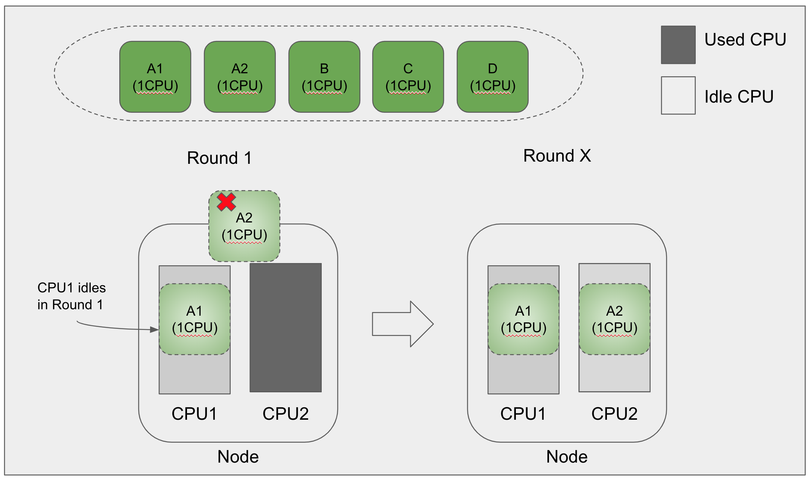
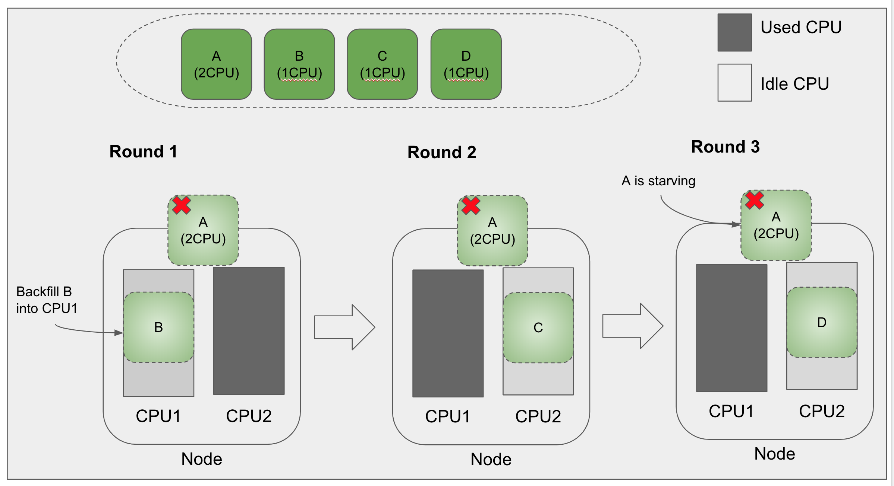
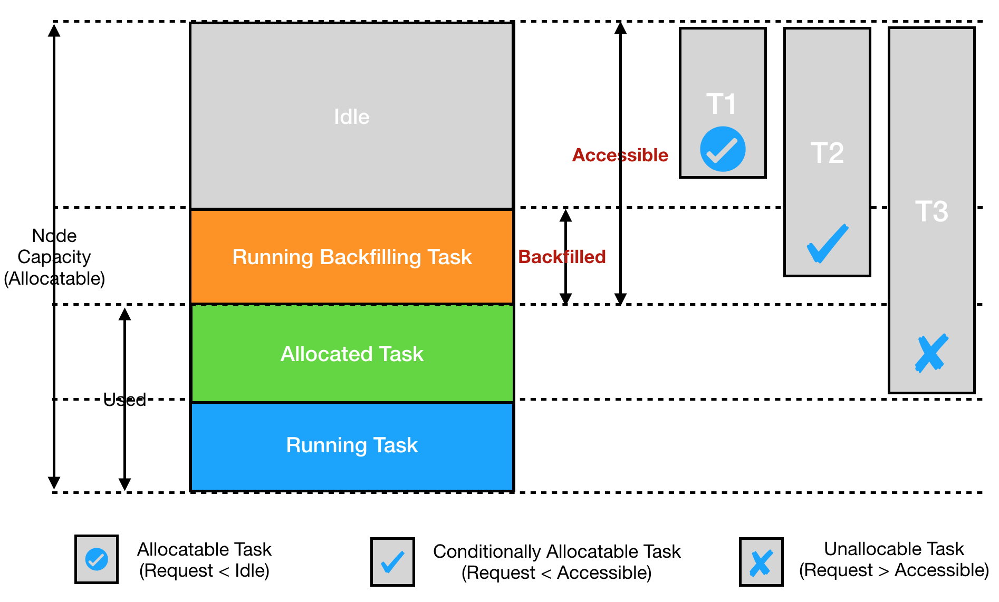
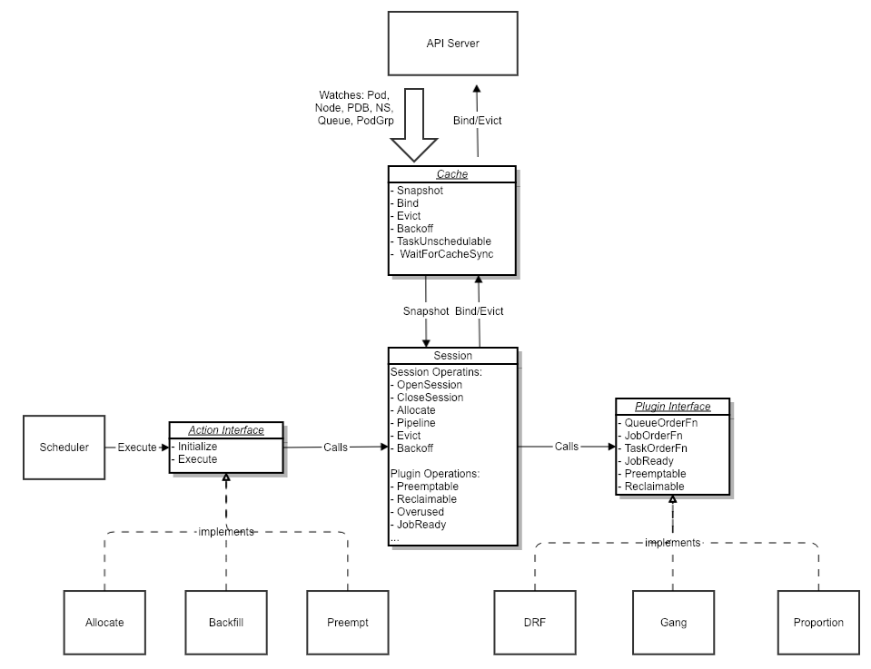

# Backfill and Starvation Prevention

## Motivation

### Backfill
The following diagrams illustrates why we need to add backfill capability to kube batch scheduler. 

We assume that task queue contains 5 tasks, A1, A2, B, C, and D, among which A1 and A2 belong to job A. We further assume that A1 and A2 each requires 1 CPU, and A1 and A2 have to start at the same time. 

Suppose the cluster has only one node. The node has two CPUs. CPU1 is idle and CPU2 is occupied. In the first round, scheduler allocates CPU1 to task A1. There is no CPU available for task A2. Since A1 and A2 have to start at the same time, A1 has to wait, even though it is allocated with enough CPU. Consequently, CPU1 will remain idle in the first round which is a waste of resource. One objective of this feature is to improve resource utilization by allowing other task to run inside allocated resources, CPU1 in this case, via backfill.



### Starvation Prevention
The following diagram illustrates why we need to add starvation prevention capability into kube batch scheduler.

Suppose task A requires 2 CPUs. In the first round, scheduler notices that the node does not have enough CPU to accommodate task A, therefore the scheduler will skip task A, and allocate CPU1 to task B. In the second round, suppose task B occupies CPU1, and CPU2 becomes available.  In this case, we still only have one idle CPU, therefore task A will be skipped again. Scheduler will allocate the node to task C. If this pattern goes on, task A will be starved. Preventing task A from being starved is another issue we need to address in this project.



## Objectives
* Improve Resource Utilization with Backfill
  * When we schedule jobs by their priorities, we may run into situations where resources are allocated to tasks of a job which is not ready to run. This behavior leads to suboptimal resource utilization.
  * One goal of this project is to improve resource utilization with backfill - to run tasks in those allocated, but unused, resources.

* No Starvation
  * A job’s wait time should be bounded if 1) the amount of resources requested by the job is less the cluster’s total capacity, and 2) no continuous arrival of higher priority jobs.
  * It is acceptable for a job to wait forever if the amount of its requested resources is greater than the total capacity of the cluster. This issue will be addressed by cluster auto scaling.
  * It is acceptable for a job to wait forever if jobs with higher priority keep coming. In this case, the customer needs to increase the priority of the starving job.

## Terminologies
This design document introduces the following new terminologies.

* Starving Job
  
  A job that has been in pending state longer than starvation threshold. Starvation threshold is a scheduler configuration.

* Backfill Task
  
  Tasks run inside resources that are allocated to other tasks.

* Backfilled Resource

  Resources on a node that are occupied by backfill tasks
  
* Accessible Resource

  Accessible Resources of a node is the sum of the node’s idle resource and the node’s backfilled resource

* Allocated Task

  Task allocated with idle resources
  
* Conditionally Allocated Task

  Task allocated with backfilled resources. A conditionally allocated task is a task that has been allocated with accessible resources which include idle resources and backfilled resources. Idle resources are ready to use. Backfilled resources are resources that are currently occupied by some backfill tasks. After backfill tasks exit (either voluntarily or being preempted), the conditionally allocated task should have enough resource to start. In order words, the task will have enough resources if backfill tasks exit.

* Ready

  A job is ready to run if the number of its allocated tasks is greater than the job’s Minimum Available configuration.
  
* Conditionally Ready

  A job is *conditionally* ready (to run) if the number of its allocated tasks is less than job’s Minimum Available configuration, but the number of conditionally allocated tasks is greater than the job’s Minimum Available configuration.  In preemption mode, a conditionally ready job will evict some backfilling tasks, and then start. In non-preemption mode, a conditionally ready job will disable backfill on its allocated resources, wait for existing backfilling jobs to finish, and then start.
  
## Data Model

### TaskInfo
* Introduce `BackfillAnnotationKey`. For each backfill task, we will add this annotation to its corresponding Pod.
* Add `IsBackfill` field in TaskInfo. 
* Introduce three readiness in Job. See terminology section for definitions.
  * Ready
  * Conditionally Ready
  * Not Ready

```golang

const BackfillAnnotationKey = "scheduling.k8s.io/kube-batch-backfill"

type TaskInfo struct {
  UID         TaskID
  Job         JobID
  Name        string
  Namespace   string
  Resreq      *Resource
  InitResreq  *Resource
  NodeName    string
  Status      TaskStatus
  Priority    int32
  VolumeReady bool
  Pod         *v1.Pod
  IsBackfill  bool
}

func (ji *JobInfo) GetReadiness() JobReadiness {
  if allocatedTasksCnt >= ji.MinAvailable {
     return Ready
  } else if conditionallyAllocatedTasksCnt >= ji.MinAvailable {
     return ConditionallyReady
  }
  return NotReady
}
```

### NodeInfo
* Add `Backfilled` Resource in NodeInfo. Backfilled resources are resources occupied by backfill tasks.
* Add `GetAccessibleResource` method in NodeInfo. Accessible resource is the sum of idle resource and backfilled resource. 

```golang
type NodeInfo struct {
  Name string
  Node *v1.Node
  Releasing *Resource
  Idle *Resource
  Used *Resource
  Allocatable *Resource
  Capability  *Resource
  Tasks map[TaskID]*TaskInfo
  Backfilled *Resource
}

func (ni *NodeInfo) GetAccessibleResource() *Resource {
  idle := ni.Idle.Clone()
  return idle.Add(ni.Backfilled)
}
```
	 
The following diagram illustrated the relations between *Allocatable*, *Idle*, *Used*, *Accessible*, and *Backfilled* in `NodeInfo`. Accessible resources of a node is the sum of the node's idle resources and backfilled resources. Task T1 is an allocatable task because its request amount is less than the node’s idle amount. Task T2 is a conditionally allocatable task because its request amount is greater than the node’s idle amount, but less than the node’s accessible amount. Task T3 is an unallocable task because its request amount is greater than the node’s accessible amount.


 
## Algorithm

Kube batch scheduler does scheduling in rounds. In each round, it runs the following four scheduling actions in order: reclaim, allocate, preempt, backfill. The actual action sequence is configurable. 

This section describes the gist of the algorithm. To visualize how the algorithm works, please take a look at [the slides](https://docs.google.com/presentation/d/1kWbR0_lRGSjkgCnUoySNUktIqKVcR2OOTsyq7WtUIGI/edit#slide=id.g509241a485_0_1041).

### Allocation Phase
* In allocation phase, we allocate resources on a node to a task, if either of the following two conditions is true
  * The job is starvating. If a job is starving, we will allocate the remaining resources (of a node) to the task even if the node’s remaining resource is less than the task’s request resource. By doing so, we prevent the scheduler from allocating the remaining resources to other jobs. In other words, we reserve the remaining resources for the starving job. Eventually, some running jobs on the node will finish running, and the starving task will get enough resource to start. This is how we prevent a job from be starved for ever.
  * The task’s request resource is less than the node’s accessible resource. Remember that accessible resource include idle resource and backfilled resource. If a task’s request resource is less than a node’s accessible resource, it means that the task should have enough resource to start if backfill tasks finish running or being evicted. 
* At the end allocation phase, we do the following things based on a job’s state. 
  * We call dispatcher to bind pod to node if the job is in ready state. In other words, we will start the job. 
  * We do nothing if the job is not in ready state.

### Backfill Phase
* If a job is starving, we do nothing. We will not release resources allocated to starving tasks. In other words, we will not backfill tasks into resources owned by a starving tasks. The resources be allocated for the starving task until the task gets enough resources to start.

* If a job is ready or conditionally ready, we do nothing. We will not release resources allocated to ready or conditionally ready tasks. In other words, we will not backfill tasks into resources owned by ready or conditionally ready tasks. 

* If a job is neither ready nor conditionally ready, we will release resources allocated to it. Then we will schedule, or backfill, other tasks into the released resources.


### Notes

The reservation based starvation prevention design described above has one assumption - it assumes that the order of nodes is stable across scheduling rounds. If the scheduler sees nodes in one order, say [n1, n2, …, nm], in round x, it expects to see the nodes in the same order in round x+1. Starvation may happen if node order is not stable. T

Assume node n1, n2, and n3 are reserved for job J in round x. If the node ordering is stable, n1, n2 and n3 will be reserved for job J in following rounds as well. In other words, no new task will be scheduled to n1, n2, and n3 after round x. As a result, running tasks on n1, n2 and n3 will gradually finish, and eventually we will have enough resource for job J. 

If the node ordering is not stable, then we may reserve different set of nodes in different rounds. For example, we may reserve n1, n2, and n3 in odd round, and reserve n4, n5, and n6 in even round. As a result, job J will be starved.


## References

### Kube-batch Architecture


### Kube-batch Plugin

|           | DRF | Gang | Predicates | Priority | Proportion |
|-----------|-----|------|------------|----------|------------|
|Queue Order|            | Y(by share)|          |            |
|Job Order  |Y(by share) |Y (by readiness)|      |Y (by JobInfo priority)||
|Task Order |     |      |            |Y (by TaskInfo priority) ||
|Over Used  |     |      |            |          |Y (by share)|
|Predicate  |     |      | Y          |          |            |
|Job Ready  |     |Y (by minimum available)| |   |            |
|Preemptable|Y (by share)|Y (by minimum available)| | |       |
|Reclaimable|     |      |            |          |Y (by share)|


