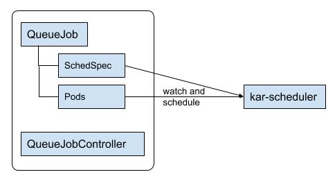
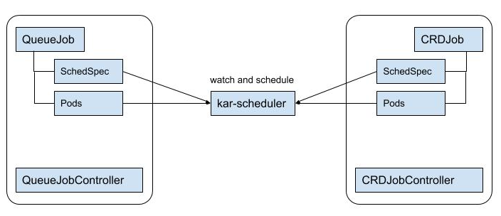

# Kubernetes Gang-Scheduling

**Authors**: @k82cn , **Shepherds**: @vishh, @bsalamat

**SIG/WG**: sig-scheduling, ML-WG

## Motivation

After the discussion at [Gang-scheduling](https://docs.google.com/document/d/1AUwcvTtULNvow5M9e428FnlvINO1uQ7ojRoTGuTp4DA/edit#heading=h.ckn8nv2jj0xv) proposal, we decide to make Gang-scheduling API out of core by CRD, and implement it in [kube-arbitrator](https://github.com/kubernetes-incubator/kube-arbitrator). kube-arbitrator focus on "batch" workload in kubernetes, and will share the same [scheduling frameworks](https://github.com/kubernetes/community/pull/2281) when it's ready. This document is used to provide definition of CRD for gang-scheduling, and suggestion of customized job controllers.

## Function Detail

### CRD Definition

Although workload lifecycle requirements maybe different, e.g. MPI vs. Spark, the requirements to scheduler are similar. To meet both scheduling and lifecycle requirements, two **Kinds** are going to be defined. One new **Kind**, named `SchedulingSpec`, is defined as follow for scheduler:

```go
// SchedulingSpec defines the scheduling requirement of a 'Job'
type SchedulingSpec struct {
    metav1.TypeMeta
    metav1.ObjectMeta

    Spec SchedulingSpecTemplate
}

// SchedulingSpecTemplate represents the template of SchedulingSpec.
type SchedulingSpecTemplate struct {
    // If specified, indicates the Job's priority. "system-node-critical" and
    // "system-cluster-critical" are two special keywords which indicate the
    // highest priorities with the former being the highest priority. Any other
    // name must be defined by creating a PriorityClass object with that name.
    // If not specified, the Job's priority will be default or zero if there is no
    // default.
    // +optional
    PriorityClassName string

    // The priority value. Various system components use this field to find the
    // priority of the Job. When Priority Admission Controller is enabled, it
    // prevents users from setting this field. The admission controller populates
    // this field from PriorityClassName.
    // The higher the value, the higher the priority.
    // +optional
    Priority *int32

    // NodeSelector is a selector which must be true for the pod of 'Job' to
    // fit on a node. Selector which must match a node's labels for the pod of
    // 'Job' to be scheduled on that node.
    // +optional
    NodeSelector map[string]string

    // MinAvailable defines the minimal available tasks to run the Job;
    // if there's not enough resources to start all tasks, the scheduler
    // will not start anyone.
    MinAvailable int
}
```

The `SchedulingSpec` defines necessary parameters of Job for scheduler, e.g. priority of Job, minimal available tasks of Job. `SchedulingSpec` does not include lifecycle parameters which are managed by following new **Kind**, named `QueueJob`:

```go
// QueueJob is a Kind for batch workload.
type QueueJob struct {
    metav1.TypeMeta
    metav1.ObjectMeta

    // Specification of the desired behavior of a QueueJob,
    // including the minAvailable.
    Specs QueueJobSpec

    // Current status of QueueJob
    Status QueueJobStatus
}

// QueueJobSpec describes how the job execution will look like and
// when it will actually run.
type QueueJobSpec struct {
    // A label query over pods that should match the pod count.
    // Normally, the system sets this field for you.
    // +optional
    Selector *metav1.LabelSelector

    // SchedSpec specifies the parameters for scheduling.
    SchedSpec SchedulingSpecTemplate

    // TaskSpecs specifies the task specification of QueueJob
    TaskSpecs []TaskSpec
}

// QueueJobStatus represents the current state of a QueueJob.
type QueueJobStatus struct {
    // The number of actively running pods.
    // +optional
    Running int32

    // The number of pods which reached phase Succeeded.
    // +optional
    Succeeded int32

    // The number of pods which reached phase Failed.
    // +optional
    Failed int32

    // The minimal available pods to run for this QueueJob
    // +optional
    MinAvailable int32
}

// TaskSpecs specifies the task specification of QueueJob
type TaskSpec struct {
    // Replicas specifies the replicas of this TaskSpec in QueueJob.
    Replicas int32
 
    // Specifies the pod that will be created for this TaskSpec
    // when executing a QueueJob
    Template v1.PodTemplateSpec
}
```

`QueueJob` is the default **Kind** for batch job, it includes multiple types of tasks according to the requirements from ML frameworks, e.g. Tensorflow. `QueueJob` also uses `SchedulingSpec` to describe its requirements to scheduler. The `QueueJob` is managed by `QueueJobController` in `kar-controllers`, the detail function is described in following section.

### kar-scheduler (scheduler component of kube-arbitrator)

The scheduler only watches `SchedulingSpec` and `Pod`; it'll reconstruct 'Job' by `OwerReference` of controller (`OwnerReference.Controller == true`), and the `Pod`s are consider as 'Task' of 'Job'. That requires controller set the `OwerReference`  correctly. Different from other components, `kar-scheduler` does not use `LabelSelector` to reconstruct the job because of performance concern.

As `kar-scheduler` and `kube-scheduler` maybe running in parallel; `kar-scheduler` follows multi-scheduler feature to only handle the `Pod` and `SchedulingSpec` that submitted to `kar-scheduler`. The `kar-scheduler` schedule jobs as follow:

1. Reconstruct Job by `OwnerReference` of `Pod` and `SchedulingSpec`; the objects (`Pods` and `SchedulingSpec`) with same `OwerReference` are considered belonging to the same job
2. If `SchedulingSpec` is not created, the job will not be scheduled
3. In `predicate` phase, filter nodes for each job; if no `NodeSelector`, all nodes are candidates
4. In `allocate` phase, `kar-schedular` will allocate resource to job; and bind `Pod` to host until job ready (`minAvailable` <= `allocated Pods`)
5. If can not allocate enough resources to the job, the resource can not allocate to other job until next scheduling cycle

That may make resources (less than job's resource request) idle for a while, e.g. a huge job. One of solution is to backfill other smaller jobs to improve the resource utilization.

### kar-controllers (controllers component of kube-arbitrator)

Similar to `kube-controller-manager`, `kar-controller` is a collection of controllers, including `QueueJobController` and `QueueController` (in future).  `QueueJobController` manages the lifecycle of `QueueJob` as following:

* **Pod/QueueJob Creations**: The `QueueJobController` will create pods up to `.spec.SchedSpec.minAvailable` ordered by priority in `spec.TaskSpecs.Template` (TBD, the controller did not know priority based on priority class), and waiting for `kar-scheduler` to schedule pods in batch. `QueueJobController` will handle `QueueJob` by priority: creating `.spec.SchedSpec.minAvailable` pods for QueueJob firstly, and then creating others pods (exceed `.spec.SchedSpec.minAvailable`) in round robin. When exceed `ResourceQuota`, that makes sure only the `QueueJob` with lowest priority is impact.  After creating, `QueueJob`'s (`.spec.SchedSpec.minAvailable`) maybe scale up; if `Quota` exceeded, the scheduler will not schedule the `QueueJob` for the new pods until all pods are created.

* **Pod Failures/Deletion/Unschedulable**: When a pod was failed, deleted or unschedulable, `QueueJobController` manages `QueueJob`'s lifecycle according to its status:

  1. `Number of Running pods` < `.spec.SchedSpec.minAvailable` : If the number of running pods less then `.spec.SchedSpec.minAvailable`, the `QueueJobController` will kill the whole QueueJob and recreate pods for rescheduling in batch.

  2. `Number of Running pods` >= `.spec.SchedSpec.minAvailable`: If there are still enough running pods for the `QueueJob`, the `QueueJobController` will only recreate failed pods, and wait for scheduler to bind the pending pods.


* **QueueJob Update/Delete**: There's not rolling update for `QueueJob` ; if pod template was updated, the whole `QueueJob` is re-created. If `QueueJob` was deleted, all its pods and `SchedulingSpec` will be cleanup.





### Customized controller

A typical example of customized controller is [kubeflow/tf-operator](https://github.com/kubeflow/tf-operator), which managed the Pods for TensorFlow on Kubernetes, required `gang-scheduling` in upstream. Here's an example of customized controller that demonstrated the usage of  `gang-scheduling` in `kube-arbitrator`.

Usually, CRD ([CustomResourceDefinitions](https://kubernetes.io/docs/concepts/extend-kubernetes/api-extension/custom-resources/)) feature is used to introduce a customized **Kind**, named `CRDJob` as example. The customized controller, named `CRDJobController`, watches it and manages lifecycle of it:

1. For each `CRDJob`, `CRDJobController` creates a `CRDJob` with `SchedulingSpec` whose `OwnerReference` is the `CRDJob`. The attributes of `SchedulingSpec`should be set accordingly, e.g `minAvailable`; it's up to customized controller on how to manage relationship between `SchedulingSpec` and `CRDJobob`, e.g. `metadata.name`
2. When `CRDJobobController` create Pods, it also need to set Pod's `OwnerReference` to  `CRDobJob`.  `kar-scheduler` follows gang-scheduling logic to schedule those pods in batch.
3. When pods failed/deleted/unschedulable, it up to `CRDJobController` on how to manage `CRDJob`'s lifecycle. If `CRDJob` was deleted, the `SchedulingSpec` must be deleted accordingly.




## References

* [Gang scheduling in Kuberentes](https://docs.google.com/document/d/1AUwcvTtULNvow5M9e428FnlvINO1uQ7ojRoTGuTp4DA/edit#heading=h.ckn8nv2jj0xv)
* [Indexed Job](https://github.com/kubernetes/kubernetes/issues/14188)
* [Schedule a group of pods all at once](https://github.com/kubernetes/kubernetes/issues/16845)
* [kubeflow/tf-operator: Prevent scheduling deadlocks](https://github.com/kubeflow/tf-operator/issues/165)
